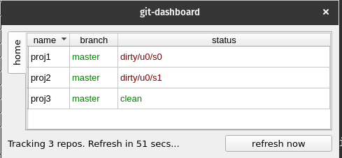

# git-dashboard

`git-dashboard` creates a Dashboard to monitor the status for multiple repositories.

Repositories can be organized into groups, so one can switch from one group to another seamlessly.



# Installation

```
$ pip install git_dashboard
```

# Usage

Simply run:

```
$ git-dashboard &
```

to start with the default dashboard. The program will search for git repositories in the user's home
directory and create a configuration file called `config.yaml`.

# Configuration

Configuration file is a simple YAML file that lists the different repositories in groups.

Suppose we have these 8 repos that we want to track:

```
/home/john/Projects/foo/.git
/home/john/Projects/bar/.git
/home/john/Projects/baz/.git
/home/john/bin/.git
/home/john/nasa/proj1/.git
/home/john/nasa/proj2/.git
/home/john/nasa/proj3/.git
/home/john/misc/.git
```

We can classify the above 3 repos into 3 groups like this:

```
projects:
  - /home/john/Projects  # will include `foo`, `bar`, `baz`

nasa:
  - /home/john/nasa  # will include `proj1`, `proj2`, `proj3`

misc:
  - /home/john/misc  # individual repos can be listed too
  - /home/john/bin
```

Type:

```
$ git-dashboard -h
```

to see the location of the configuration file.
